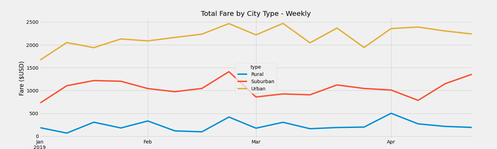

# PyBer_Analysis

Exploratory Analysis on Pyber (a company similar to Uber) using Python, Pandas and Matplot

## Purpose:

An exploratory analysis was completed for Pyber (a company similar to Uber) using Python scripts, Pandas libraries, and Matplot to discover differences in ride-sharing data among different city types to help Pyber keep their services affordable and accessible to their customers.

## Analysis Results:

### Ride-sharing summary DataFrame by City Type:

In the Data Frame below, we can see the number of total rides, drivers and fares all moving in the same direction when comparing Rural, Suburban and Urban areas. For instance, there are thirteen times more rides, 30 times more drivers and 9 times more dollars made in Urban areas than in Rural areas.

In the last two columns, we see a different story. When we look at Average Fare per Ride and Average Fare per Driver, we can see that Urban areas averages are much higher than Suburban and Urban areas. 

### Multiple-line Chart of Total Fares for Each City Type

From the chart displayed below, we can see that Urban earnings is more volatile. We don't see the peaks and valleys in Suburban and Rural areas that we do in Urban areas. 

## Summary: 

If PyBer wants to keep services affordable, we need to do more investigation on why the average fare per ride is so high and what we can do to lower the fares in the Suburban and Rural areas.

PyBer should also have metrics for the number of requests Pyber drivers were unable to commit to in each area. More investigation needs to be done on what would happen if PyBer recruited more drivers for Rural and Suburban areas, could PyBer make more money?  

Pyber also should validate what is causing the peaks and valleys seen. Is it seasonal? Are their specific events during these time frames? Is this an indication that the market is saturated at times? Do we see these patterns over several years?

